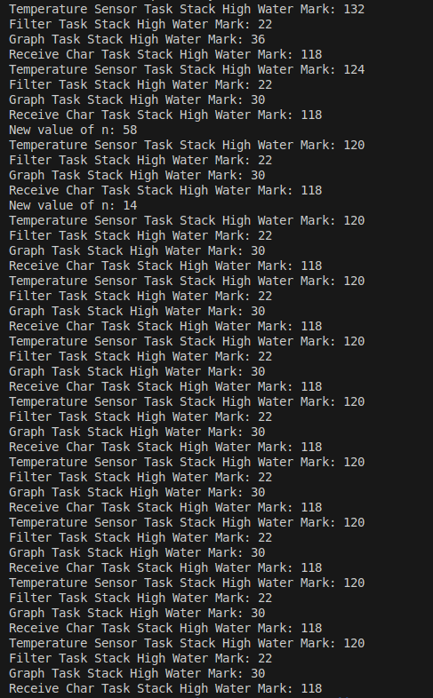
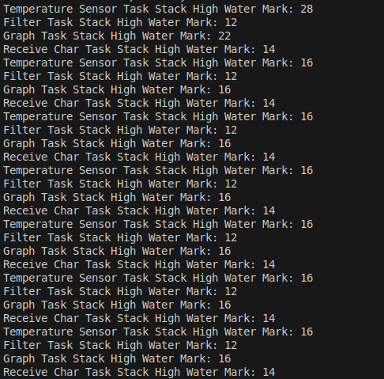

# TP N° 4 - Sistemas Operativos II - FreeRTOS

## Objetivo

El objetivo de este trabajo es implementar una aplicación de FreeRTOS sobre un sistema __Stellaris LM3S811__ (emulada con __QEMU__) que debe contar con las siguientes tareas:

- Una tarea que simule un sensor de temperatura generando valores aleatorios con una frecuencia de 10 Hz.

- Una tarea que funcione como filtro pasa bajos tomando los valores del sensor de temperatura y calculando el promedio de los últimos N valores. Donde N es un parámetro ingresado por el usuario mediante UART.

- Una tarea que se encargue de graficar en el tiempo los valores de la salida del filtro.

- Una tarea tipo Top de Linux que muestre información de las tareas (%CPU, Stack, ticks, etc).

- Para cada tarea se debe calcular el stack size necesario.

## Requerimientos

Para poder implementar esta aplicación se necesita:

- El emulador [QEMU](https://www.qemu.org/download/) para la plataforma __Stellaris LM3S811__.

- La [demo](https://www.freertos.org/Documentation/02-Kernel/01-About-the-FreeRTOS-kernel/03-Download-freeRTOS/01-DownloadFreeRTOS) sobre la que empezar a trabajar. Es la segunda opción, no la LTS.

- Y [gcc-arm-none-eabi](https://developer.arm.com/downloads/-/gnu-rm) para compilar el código. También se puede instalar con el siguiente comando:
     ```bash
     sudo apt install gcc-arm-none-eabi
     ```

Para buildear el proyecto y correr la aplicación en el emulador se puede correr el script [run.sh](./run.sh) que se encuentra en la carpeta raíz del proyecto. (Recordar darle permisos de ejecución con `chmod +x run.sh`)

```bash
sudo ./run.sh
```

## Desarrollo

Para el desarrollo se implementaron las tareas solicitadas más la tarea `vMonitorTask` que fue temporal y si se quiere ejecutar se debe setear en 1 la macro `MONITORING_STACK_WATER_MARK`. Esta tarea se usó para ver el stack size necesario para cada tarea, de esto se hablará más adelante.

Entonces las tareas implementadas son:

- __vTemperatureSensorTask__
- __vFilterTask__
- __vGraphTask__
- __vReceiveCharTask__
- __vMonitorTask__
- __vTopTask__

Las tareas se comunican entre sí mediante Queues.

### vTemperatureSensorTask

Para el sensor de temperatura se usó el generador de números aleatorios tomado de un repositorio fork NO Oficial de __FreeRTOS__. Se puede ver [acá](https://github.com/istarc/freertos/blob/master/FreeRTOS/Demo/CORTEX_A5_SAMA5D3x_Xplained_IAR/AtmelFiles/libboard_sama5d3x-ek/source/rand.c).

A este número aleatorio de le aplica el módulo 3 y se le resta uno, obteniendo así un número de variación que puede ser -1, 0 o 1, este se le suma al valor de temperatura actual (que empieza en 18) y así vamos teniendo los valores variados de temperatura.

Luego este valor se envía por una Queue a la tarea `vFilterTask`.

### vFilterTask

Esta tarea recibe por la Queue `xTemperatureQueue` el nuevo valor de temperatura del sensor y lo guarda en la primera posición de un buffer donde almacena todas las temperaturas que recibe. Este buffer es de tamaño fijo, el cual se puede cambiar con la macro `MAX_BUFFER_SIZE`. Luego calcula el promedio de los últimos N valores del buffer, donde N está especificado por una variable global `current_n` que cambiará cuando se ingrese un número por UART.

Una vez calculado el promedio, se envía el valor a través de la Queue `xGraphQueue` para que la tarea `vGraphTask` lo grafique.

### vGraphTask

La tarea de display es la más complicada, ya que el display del sistema cuenta con una dimensión de 85 columnas por 2 filas. Entonces para graficar los valores de temperatura, los cuales se representan como puntos, se debe usar una lógica en la que usando la función `OSRAMImageDraw` se envían cadenas de bytes en Octal que representan los puntos en la pantalla.

Para iniciar el LCD se usa la función `OSRAMInit()`, una vez iniciada se hace uso de las funciones `OSRAMImageDraw()` y `OSRAMStringDraw()` para graficar los puntos, los ejes y el valor actual de N.

A la función `OSRAMImageDraw()` se le pasa un puntero a un array de bytes que representa la imagen a dibujar, la posición en x e y donde se va a dibujar y el ancho y alto de la imagen.

```c
void OSRAMImageDraw(const unsigned char *pucImage,
                    unsigned long ulX,
                    unsigned long ulY,
                    unsigned long ulWidth,
                    unsigned long ulHeight)
```

Como se mencionó la lógica es a través de octales, cada uno de estos es un Byte que se grafica "transpuesto" y representa una columna, donde el bit más significativo representa la parte de abajo de la columna y el menos significativo la parte de arriba. Por ejemplo para dibujar el número 0 con tres columnas, se haría de la siguiente manera:

```bash
1 1 1
1 0 1
1 0 1
1 0 1
1 1 1
```

Entonces tomando la primera columna, el primer byte sería `0b11111000` (en octal es `370`).
El segundo byte sería `0b10001000` (en octal es `210`). Y el tercer byte sería de nuevo `0b11111000` (en octal es `370`). Entonces la función `OSRAMImageDraw()` se llamaría de la siguiente manera:

```c
OSRAMImageDraw("\370\210\370", 0, 0, 3, 1);
```

Así, siguiendo esta lógica se hace un mapeo de los valores y los octales correspondientes a tomar según el valor de temperatura recibido desde la tarea del Filtro. Además se debe tener en cuenta que si se tiene que graficar un punto en la fila inferior, el dibujo de este interferirá con el dibujo del eje de las abscisas, entonces en el octal se debe poner en 1, además del bit correspondiente al punto, el bit más significativo que corresponde al eje x.

### vReceiveCharTask

Para poder cambiar el valor de N, se configuró el UART0 para generar una interrupción cuando recibe un dato, cuando esto pasa, en la ISR correspondiente, se envía el valor mediante la Queue `xUARTQueue` a esta tarea, la cual se encarga de procesar el caracter recibido y cambiar el valor de `current_n` si el caracter es un número.

Se implementó la lógica con un buffer que almacena dígitos hasta que se recibe el caracter correspondiente al enter, entonces se convierte el contenido del buffer a un número y este valor se asigna a `current_n`. Si el valor ingresado es superior al tamaño del buffer, `current_n` se setea en este máximo tamaño.

### vMonitorTask

La tarea de monitoreo se implementó temporalmente para poder medir la utilización de stack de las distintas tareas y así poder determinar qué stack size asignarle a cada una de ellas. Se decidió dejarla implementada para que quien lo desee pueda ver esta información, sin embargo la misma se puede ver los datos que envía por UART la tarea `vTopTask`.

Para ver el stack utilizado por las tareas, se usó la función `uxTaskGetStackHighWaterMark()` que devuelve el espacio libre mínimo en la pila que ha habido desde que se inició la tarea. Cuanto menor sea el número devuelto, más cerca ha estado la tarea de desbordar su pila. Este valor está en palabras, o sea que en un sistema de 32 bits, un valor de 1 corresponde a 4 Bytes.

Para usar esta función se debe setear en 1 la macro `INCLUDE_uxTaskGetStackHighWaterMark` en el archivo [FreeRTOSConfig.h](./Demo/CORTEX_LM3S811_GCC/FreeRTOSConfig.h).

Estos fueron algunos de los valores obtenidos partiendo con un stack size de 160 para todas las tareas:



Tomando un promedio para cada tarea, restando este a los 160 iniciales y sumándole un valor más alto para considerar situaciones de mayor uso, se asignaron los siguientes valores:

- __vTemperatureSensorTask__: $160 - 123 = 37 \Rightarrow 55$

- __vFilterTask__: $160 - 22 = 138 \Rightarrow 150$

- __vGraphTask__: $160 - 31 = 129 \Rightarrow 145$

- __vReceiveCharTask__: $160 - 118 = 42 \Rightarrow 55$

Luego de esto, como era de esperar, los resultados devueltos por `uxTaskGetStackHighWaterMark()` fueron menores:



### vTopTask

Esta tarea se encarga de tomar información de las tareas actuales del sistema y enviarla por UART. 

Para obtener la información de las tareas se usa la función `uxTaskGetSystemState()` la cual llena una estructura __TaskStatus_t__ para cada tarea del sistema. Las estructuras __TaskStatus_t__ contienen, entre otras cosas, miembros para el identificador de la tarea, el nombre de la tarea, la prioridad de la tarea, el estado de la tarea y la cantidad total de tiempo de ejecución consumido por la tarea, etc.

Para poder usar esta función se deben configurar algunas macros en [FreeRTOSConfig.h](./Demo/CORTEX_LM3S811_GCC/FreeRTOSConfig.h), estas son:

```c
#define configUSE_TRACE_FACILITY        1
#define configGENERATE_RUN_TIME_STATS	1
#define INCLUDE_eTaskGetState           1
#define portCONFIGURE_TIMER_FOR_RUN_TIME_STATS()    ( prvConfigTimer() )
#define portGET_RUN_TIME_COUNTER_VALUE()            ( ulGetRunTimeCounterValue() )
```

Donde `prvConfigTimer()` y `ulGetRunTimeCounterValue()` son funciones que se deben implementar en el archivo [main.c](./Demo/CORTEX_LM3S811_GCC/main.c). Estas funciones son para configuran el Timer para interrumpir e incrementar el contador de tiempo de ejecución de las tareas y para obtener el valor del contador respectivamente.

La salida se ve así

```bash
TASK    CPU%    STACK FREE      TICKS
---------------------------------------
Top     <1%     12              1
IDLE    98%     150             39232
UART    <1%     14              0
Sensor  <1%     20              10
Graph   1%      16              602
Filter  <1%     12              13
```
